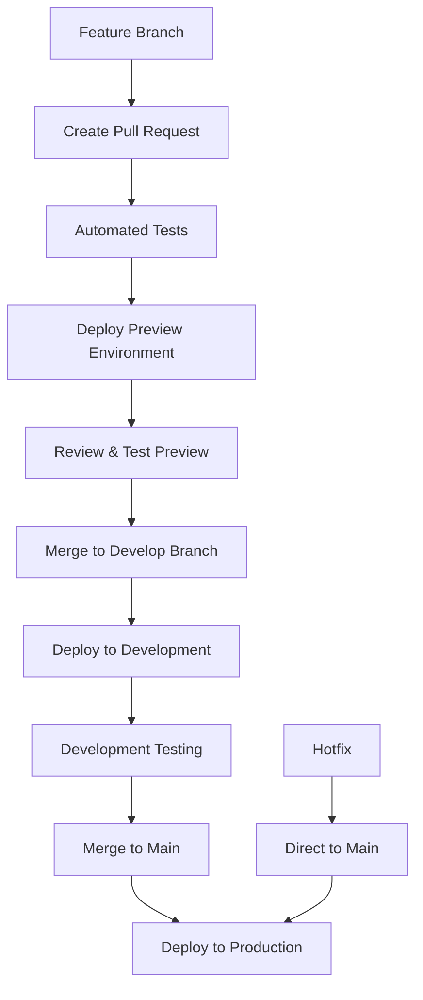

# ADR-011: Preview and Production Environments with Branch-based Deployment

## Status
**Status**: Implemented  
**Date**: 2025-08-29  
**Authors**: System Architect  
**Reviewers**: Development Team  
**Implementation Completed**: 2025-08-29  

## Context and Problem Statement

The current MCP Workflowy server deployment operates with a single production environment on Cloudflare Workers, creating risk when deploying changes and making it difficult to test new features safely. Without a development environment or preview capabilities, any deployment directly affects production users, and there's no safe way to validate changes before release.

What architectural problem are we solving?
- Missing safe deployment workflow with development environment validation
- No preview environment for testing changes before production
- Risk of production downtime or issues during deployments
- Lack of environment-specific configuration management
- Missing native Cloudflare Workers features for development workflow

## Decision Drivers

* **Deployment Safety**: Enable safe testing of changes in development environment before production
* **Risk Mitigation**: Use Cloudflare's native environment features to reduce production risk
* **Development Workflow**: Leverage native preview URLs for feature testing and collaboration
* **Simplicity**: Two-environment setup (dev/production) with native Cloudflare features
* **Environment Isolation**: Separate Workers with different configurations and secrets
* **Native Features**: Use Cloudflare's built-in environment and preview URL capabilities

## Considered Options

1. **Two-Environment Setup**: Preview and production with native Cloudflare environments
2. **Three-Environment Setup**: Development, staging, and production environments  
3. **Single Environment with Branches**: Keep single environment with branch-based deployments
4. **External Preview Service**: Use third-party service for preview deployments

## Decision Outcome

**Chosen option**: Two-Environment Setup - Preview and production with native Cloudflare environments and branch-based deployment

### Positive Consequences

* **Safe Deployment Process**: Changes validated in preview environment before production
* **Branch-based Workflow**: Automatic deployments based on git branches (main → production, preview → preview)  
* **Pull Request Previews**: Automatic preview deployments for all PRs to main branch
* **Reduced Production Risk**: Issues caught in preview environment before affecting users
* **Simplified Setup**: Two environments are easier to manage than complex multi-stage setups
* **Native Features**: Leverages Cloudflare's built-in environment capabilities

### Negative Consequences

* **Minimal Additional Complexity**: Two environments require basic configuration management
* **Minimal Additional Costs**: One additional Cloudflare Worker instance (very low cost)
* **Simple Deployment Process**: Straightforward two-stage deployment workflow

## LLM Implementation Estimation

### Computational Requirements
| Metric | Estimation | Rationale |
|--------|------------|-----------|
| **Total Requests** | ~25 requests | Configuration updates and CI/CD pipeline setup |
| **Input Tokens** | ~15,000 tokens | Environment configuration analysis and setup |
| **Output Tokens** | ~10,000 tokens | Configuration files, scripts, documentation |
| **Processing Time** | ~45 minutes | Environment setup and pipeline configuration |
| **Model Size Required** | Medium | Configuration management and deployment scripting |
| **Context Window** | 16,000 tokens | Multiple configuration files and deployment scripts |

### Implementation Complexity Analysis
**Code Generation Scope**:
- **Lines of Code (LoC)**: ~200 lines estimated (configuration and scripts)
- **File Modifications**: ~4 files to change
- **New Files**: ~3 new files (environment configs, deployment scripts, CI/CD workflows)
- **Test Coverage**: ~10 test cases needed (environment-specific validation)

## Implementation Notes

### Current State Analysis
Based on the codebase analysis, the project already has:
- **Production deployment**: Configured in `wrangler.toml` and GitHub Actions
- **Environment variables**: WORKFLOWY_USERNAME, WORKFLOWY_PASSWORD, ALLOWED_API_KEYS
- **Build system**: Separate builds for local (`npm run build`) and worker (`npm run build:worker`)

### Two-Environment Configuration Structure

Based on the current codebase analysis and Cloudflare's native environment features:

```toml
# wrangler.toml
name = "mcp-workflowy-remote"
main = "dist/worker.js"
compatibility_date = "2024-11-06"
node_compat = true

# Default configuration (used by production)
vars = { ENVIRONMENT = "production", DEBUG = "false" }

# Development environment
[env.dev]
vars = { ENVIRONMENT = "development", DEBUG = "true" }
```

This creates two separate Workers:
- **Production**: `mcp-workflowy-remote` (default)
- **Development**: `mcp-workflowy-remote-dev` (environment)

### Preview URLs Integration (Native 2024 Feature)

Cloudflare's Preview URLs feature (available for Worker versions uploaded after 2024-09-25) provides:

```bash
# Deploy development environment with preview alias
wrangler deploy --env dev --preview-alias dev
# Creates URL: dev-mcp-workflowy-remote.<subdomain>.workers.dev

# Deploy feature branches with preview aliases
wrangler deploy --env dev --preview-alias feature-xyz
# Creates URL: feature-xyz-mcp-workflowy-remote.<subdomain>.workers.dev

# Production deployment (no preview alias needed)
wrangler deploy
# Uses production domain: mcp-workflowy-remote.<subdomain>.workers.dev
```

### Environment-Specific Secrets Management

```bash
# Development environment secrets
wrangler secret put WORKFLOWY_USERNAME --env dev
wrangler secret put WORKFLOWY_PASSWORD --env dev  
wrangler secret put ALLOWED_API_KEYS --env dev

# Production environment secrets (current - no --env flag needed)
wrangler secret put WORKFLOWY_USERNAME
wrangler secret put WORKFLOWY_PASSWORD
wrangler secret put ALLOWED_API_KEYS

# Local development (.dev.vars file)
# .dev.vars
WORKFLOWY_USERNAME=local_username
WORKFLOWY_PASSWORD=local_password
ALLOWED_API_KEYS=local-key-1,local-key-2
```

### Simplified CI/CD Pipeline (Two Environments)

```yaml
# .github/workflows/deploy.yml (simplified for dev/prod)
name: Deploy MCP Workflowy Server

on:
  push:
    branches:
      - main        # Deploy to production
      - develop     # Deploy to development
  pull_request:
    branches:
      - main        # Create preview for PRs to main

jobs:
  test:
    runs-on: ubuntu-latest
    steps:
      - uses: actions/checkout@v4
      - uses: oven-sh/setup-bun@v2
      - run: bun install
      - run: bun run test
      - run: bun run build
      - run: bun run build:worker

  deploy-dev:
    runs-on: ubuntu-latest
    needs: test
    if: github.ref == 'refs/heads/develop'
    environment: development
    steps:
      - uses: actions/checkout@v4
      - uses: oven-sh/setup-bun@v2
      - run: bun install
      - run: bun run build:worker
      - name: Deploy to Development
        uses: cloudflare/wrangler-action@v3
        with:
          apiToken: ${{ secrets.CLOUDFLARE_API_TOKEN }}
          command: deploy --env dev --preview-alias dev

  deploy-preview:
    runs-on: ubuntu-latest
    needs: test
    if: github.event_name == 'pull_request'
    steps:
      - uses: actions/checkout@v4
      - uses: oven-sh/setup-bun@v2
      - run: bun install
      - run: bun run build:worker
      - name: Deploy Preview
        uses: cloudflare/wrangler-action@v3
        with:
          apiToken: ${{ secrets.CLOUDFLARE_API_TOKEN }}
          command: deploy --env dev --preview-alias pr-${{ github.event.number }}

  deploy-production:
    runs-on: ubuntu-latest
    needs: test
    if: github.ref == 'refs/heads/main'
    environment: production
    steps:
      - uses: actions/checkout@v4
      - uses: oven-sh/setup-bun@v2
      - run: bun install
      - run: bun run build:worker
      - name: Deploy to Production
        uses: cloudflare/wrangler-action@v3
        with:
          apiToken: ${{ secrets.CLOUDFLARE_API_TOKEN }}
          command: deploy
```

### Simplified Package.json Scripts (Two Environments)

```json
{
  "scripts": {
    "dev": "wrangler dev",
    "dev:env": "wrangler dev --env dev",
    "build": "bun run build:local",
    "build:local": "bun build src/index.ts --outdir dist --target node",
    "build:worker": "bun build src/worker.ts --outdir dist --target browser --minify",
    "deploy": "wrangler deploy",
    "deploy:dev": "wrangler deploy --env dev --preview-alias dev",
    "deploy:preview": "wrangler deploy --env dev --preview-alias preview",
    "test": "bun test"
  }
}
```

### Two-Environment Configuration Management

```typescript
// src/config.ts (simplified)
interface EnvironmentConfig {
  environment: 'development' | 'production';
  debug: boolean;
  corsOrigins: string[];
  rateLimiting: {
    enabled: boolean;
    requests: number;
    window: number;
  };
  logging: {
    level: 'debug' | 'info' | 'warn' | 'error';
    enableConsole: boolean;
  };
}

export function getEnvironmentConfig(env: any): EnvironmentConfig {
  const environment = env.ENVIRONMENT || 'production';
  
  const configs: Record<string, EnvironmentConfig> = {
    development: {
      environment: 'development',
      debug: true,
      corsOrigins: ['*'],
      rateLimiting: { enabled: false, requests: 1000, window: 60 },
      logging: { level: 'debug', enableConsole: true }
    },
    production: {
      environment: 'production',
      debug: false,
      corsOrigins: ['https://claude.ai'],
      rateLimiting: { enabled: true, requests: 60, window: 60 },
      logging: { level: 'warn', enableConsole: false }
    }
  };
  
  return configs[environment] || configs.production;
}
```

### Migration Strategy (Two Environments)

1. **Step 1: Environment Configuration** - Update wrangler.toml with dev environment - **Est: 3 requests, 1,500 tokens**
2. **Step 2: Development Deployment** - Deploy and test dev environment - **Est: 4 requests, 1,800 tokens**
3. **Step 3: Preview URLs Setup** - Configure preview aliases for dev - **Est: 3 requests, 1,200 tokens**
4. **Step 4: CI/CD Pipeline Update** - Update GitHub Actions for two environments - **Est: 6 requests, 2,500 tokens**
5. **Step 5: Configuration Management** - Add simple two-environment config - **Est: 4 requests, 1,500 tokens**

### Simplified Deployment Workflow (Two Environments)



### Testing and Validation (Two Environments)

```typescript
// src/test/environment.test.ts
describe('Two-Environment Configuration', () => {
  test('development environment has correct configuration', () => {
    const config = getEnvironmentConfig({ ENVIRONMENT: 'development' });
    expect(config.environment).toBe('development');
    expect(config.debug).toBe(true);
    expect(config.rateLimiting.enabled).toBe(false);
    expect(config.corsOrigins).toContain('*');
  });

  test('production environment has secure configuration', () => {
    const config = getEnvironmentConfig({ ENVIRONMENT: 'production' });
    expect(config.environment).toBe('production');
    expect(config.debug).toBe(false);
    expect(config.logging.level).toBe('warn');
    expect(config.rateLimiting.enabled).toBe(true);
  });
});
```

### Final Implementation Summary

**Successfully Implemented**: Two-environment setup with branch-based deployment using GitHub Actions matrix strategy.

**Key Implementation Features**:
1. **Environments**: Native `[env.preview]` configuration in wrangler.toml
2. **Branch-based Deployment**: `main` → production, `preview` → preview environment
3. **Pull Request Previews**: Automatic preview deployments for PRs to main
4. **Secrets Management**: Per-environment secrets with `ALLOWED_API_KEYS` vs `ALLOWED_API_KEYS_PREVIEW`
5. **Matrix Strategy**: Single GitHub Actions job handles both environments with parameters

**Environment URLs**:
- **Production**: `mcp-workflowy-remote.<subdomain>.workers.dev`
- **Preview**: `mcp-workflowy-remote-preview.<subdomain>.workers.dev`

**Deployment Commands**:
```bash
# Production (manual)
npm run deploy

# Preview (manual)  
npm run deploy:preview

# Automatic via GitHub Actions
git push origin main      # → Production deployment
git push origin preview   # → Preview deployment
# PRs to main             # → Preview deployment
```

**GitHub Actions Matrix Configuration**:
```yaml
strategy:
  matrix:
    include:
      - environment: production
        condition: github.ref == 'refs/heads/main'
        wrangler_env: ""
        api_key_secret: ALLOWED_API_KEYS
      - environment: preview  
        condition: github.ref == 'refs/heads/preview' || github.event_name == 'pull_request'
        wrangler_env: "--env preview"
        api_key_secret: ALLOWED_API_KEYS_PREVIEW
```

## Links and References

* [Cloudflare Workers Environments Documentation](https://developers.cloudflare.com/workers/wrangler/environments/)
* [Preview URLs Documentation](https://developers.cloudflare.com/workers/configuration/previews/)
* [Wrangler Configuration Reference](https://developers.cloudflare.com/workers/wrangler/configuration/)
* [GitHub Actions Cloudflare Integration](https://github.com/cloudflare/wrangler-action)

## Alternatives Considered

**Alternative 1: Single Staging Environment**
- Simple staging mirror of production
- **Rejected**: Missing preview capabilities for feature testing

**Alternative 2: External CI/CD Platform**
- Use external platform like Vercel or Netlify for previews
- **Rejected**: Adds complexity and doesn't leverage Cloudflare's native features

**Alternative 3: Manual Deployment Process**
- Keep manual deployment with careful testing
- **Rejected**: Doesn't scale with team growth and increases risk

---

**Implementation Priority**:
- Staging environment setup is critical for safe deployments
- Preview URLs provide excellent developer experience for collaboration
- CI/CD automation reduces manual errors and improves deployment velocity
- Environment-specific configuration ensures proper isolation and security