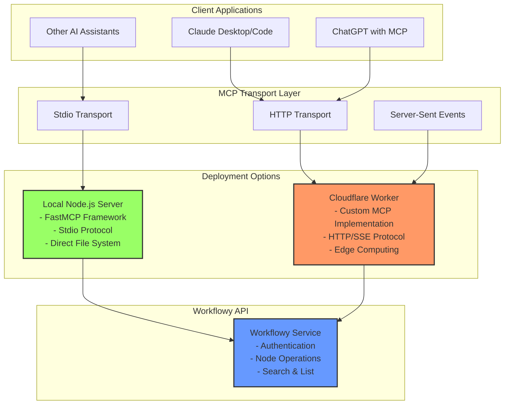
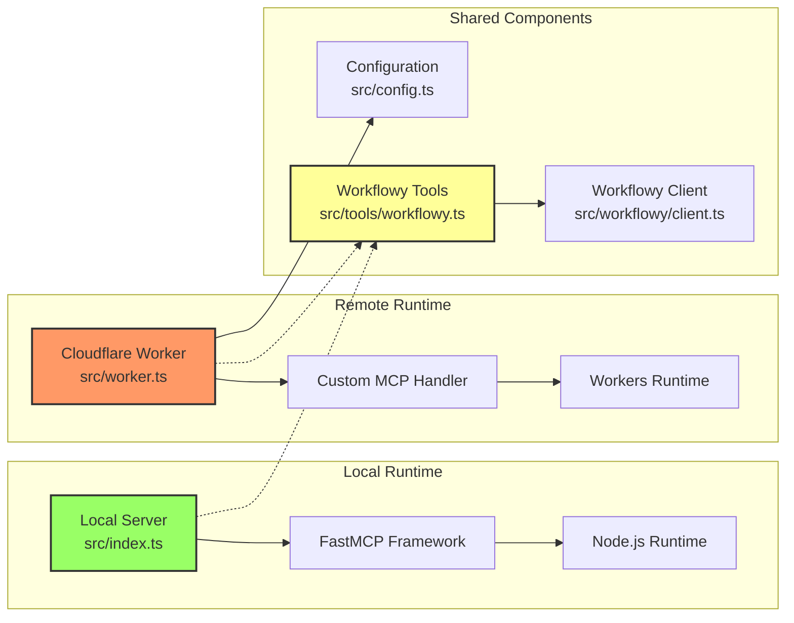
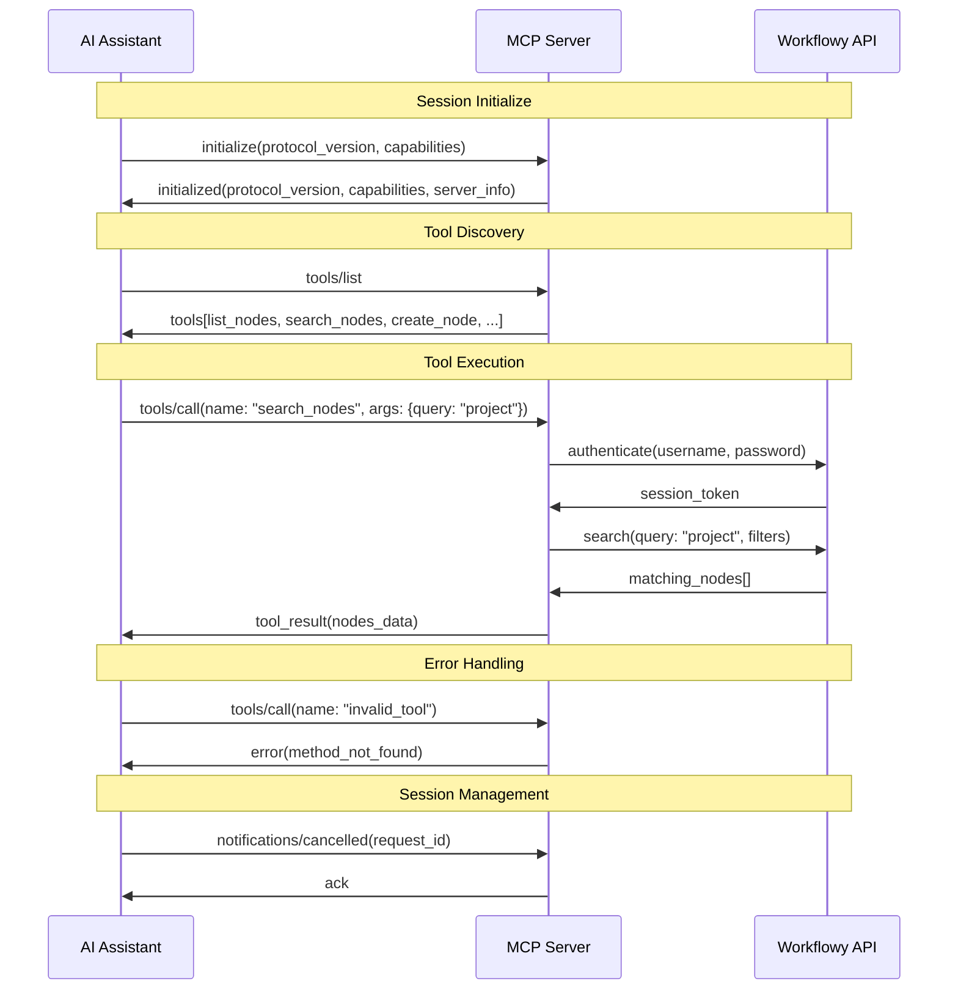
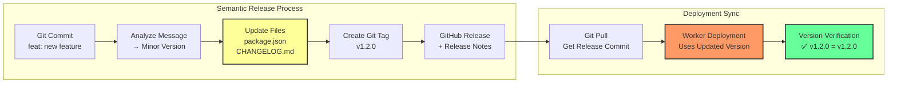
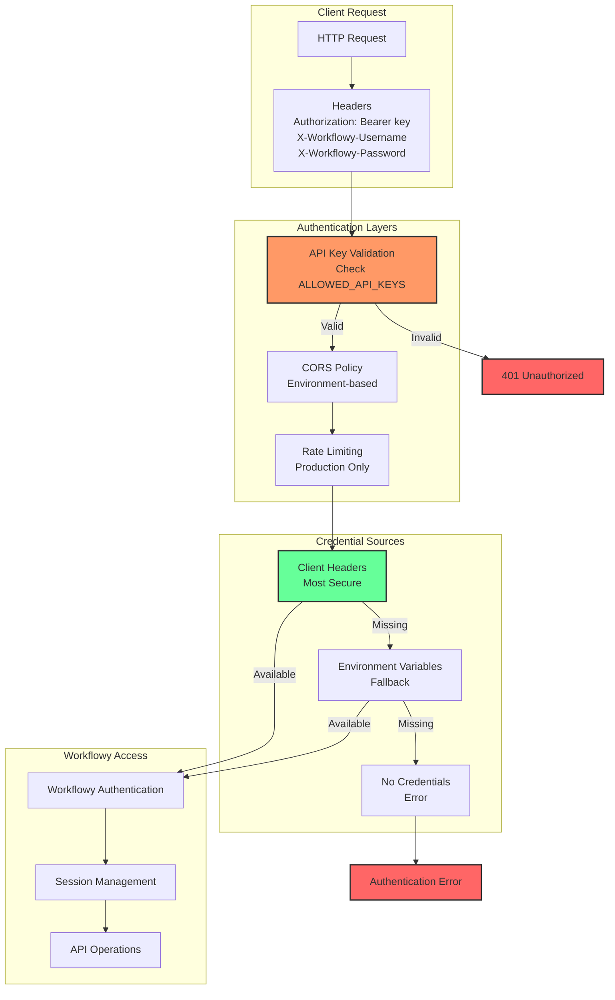
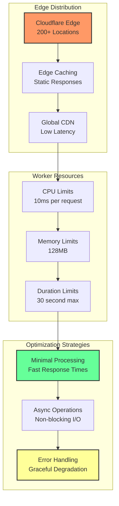

# Architecture Documentation

This document provides detailed architectural diagrams and system flow explanations for the Workflowy MCP server.

## Table of Contents

1. [System Overview](#system-overview)
2. [Dual Runtime Architecture](#dual-runtime-architecture)
3. [MCP Protocol Flow](#mcp-protocol-flow)
4. [Deployment Pipeline](#deployment-pipeline)
5. [Authentication & Security](#authentication--security)
6. [Data Flow](#data-flow)

## System Overview

The Workflowy MCP server is designed as a dual-runtime system that can operate both as a local Node.js server and as a remote Cloudflare Worker, providing flexible deployment options for different use cases.



## Dual Runtime Architecture

The system supports two distinct deployment modes, each optimized for different scenarios:



### Local Runtime Features

- **FastMCP Framework**: Leverages the battle-tested FastMCP library for MCP protocol handling
- **Stdio Transport**: Direct stdin/stdout communication with AI clients
- **Full Node.js Environment**: Access to filesystem, environment variables, and native modules
- **Development Focus**: Ideal for development, testing, and local AI assistant integration

### Remote Runtime Features

- **Custom MCP Implementation**: Lightweight, purpose-built MCP protocol handler
- **HTTP/SSE Transport**: Web-standard protocols for maximum compatibility
- **Edge Computing**: Runs on Cloudflare's global edge network
- **Production Ready**: Built for scale, security, and reliability

## MCP Protocol Flow

The Model Context Protocol defines how AI assistants communicate with external tools. Here's how our implementation handles the protocol:



### Protocol Endpoints

**Local Server (Stdio)**
- Uses FastMCP's built-in protocol handling
- Messages exchanged via stdin/stdout JSON-RPC

**Remote Server (HTTP)**
- `POST /mcp` - Main MCP JSON-RPC endpoint
- `GET /sse` - Server-Sent Events for real-time communication
- `GET /health` - Health check (no auth required)

## Deployment Pipeline

The deployment pipeline uses GitHub Actions with semantic versioning and comprehensive testing:

```mermaid
graph TB
    subgraph "Source Control"
        PR[Pull Request]
        Main[Main Branch]
        Preview[Preview Branch]
    end

    subgraph "CI/CD Pipeline"
        Tests[Run Tests<br/>- Unit Tests<br/>- Integration Tests<br/>- Coverage Report]
        SemVer[Semantic Release<br/>- Analyze Commits<br/>- Generate Version<br/>- Update package.json<br/>- Create CHANGELOG.md]
        Build[Build Process<br/>- Build Worker<br/>- Bundle Assets<br/>- Generate Artifacts]
    end

    subgraph "Deployment Targets"
        Prod[Production Worker<br/>{worker-name}<br/>.{cloudflare-account}.workers.dev]
        PrevAlias[Preview Alias<br/>preview-{worker-name}<br/>.{cloudflare-account}.workers.dev]
        PRAlias[PR-Specific URL<br/>pr123-{worker-name}<br/>.{cloudflare-account}.workers.dev]
    end

    subgraph "Verification"
        Health[Health Check<br/>✅ Server Status]
        Version[Version Validation<br/>✅ Expected vs Deployed]
        Tools[Tool Validation<br/>✅ 8 Tools Available]
        Auth[Authentication Test<br/>✅ API Key Required]
        MCP[MCP Protocol Test<br/>✅ JSON-RPC Working]
    end

    PR --> Tests
    Main --> Tests
    Preview --> Tests

    Tests --> SemVer
    SemVer --> Build
    Build --> Prod
    Build --> PrevAlias
    Build --> PRAlias

    Prod --> Health
    PrevAlias --> Health
    PRAlias --> Health

    Health --> Version
    Version --> Tools
    Tools --> Auth
    Auth --> MCP

    style Prod fill:#f96,stroke:#333,stroke-width:2px
    style PrevAlias fill:#9f6,stroke:#333,stroke-width:2px
    style PRAlias fill:#69f,stroke:#333,stroke-width:2px
    style MCP fill:#6f9,stroke:#333,stroke-width:2px
```

### Version Management Flow



## Authentication & Security

The system implements multi-tier security with environment-aware configuration:



### Security Configuration Matrix

| Environment | CORS Policy | Rate Limiting | Debug Logging | API Keys Required |
|-------------|-------------|---------------|---------------|-------------------|
| Production  | Restricted  | ✅ Enabled    | ❌ Disabled   | ✅ Required       |
| Staging     | Moderate    | ✅ Enabled    | ⚠️  Limited   | ✅ Required       |
| Development | Permissive  | ❌ Disabled   | ✅ Enabled    | ⚠️  Optional      |

## Data Flow

The data flow shows how information moves from AI assistants through the MCP server to Workflowy:

```mermaid
graph TB
    subgraph "AI Assistant"
        Query[User Query<br/>"Show my project notes"]
        Decision[Tool Selection<br/>search_nodes]
        Params[Parameters<br/>{query: "project", limit: 5}]
    end

    subgraph "MCP Server"
        Receive[Receive MCP Call<br/>tools/call]
        Validate[Validate Parameters<br/>Zod Schema]
        Auth[Authenticate<br/>API Key + Workflowy]
        Execute[Execute Tool<br/>workflowyTools.search_nodes]
    end

    subgraph "Workflowy Client"
        Login[Login to Workflowy<br/>Get Session Token]
        Search[Search API Call<br/>GET /search?q=project]
        Parse[Parse Response<br/>Extract Node Data]
        Filter[Apply Filters<br/>limit, maxDepth, preview]
    end

    subgraph "Response Processing"
        Format[Format Response<br/>MCP Tool Result]
        Return[Return to Assistant<br/>JSON-RPC Response]
        Present[Present to User<br/>Formatted Results]
    end

    Query --> Decision
    Decision --> Params
    Params --> Receive
    Receive --> Validate
    Validate --> Auth
    Auth --> Execute
    Execute --> Login
    Login --> Search
    Search --> Parse
    Parse --> Filter
    Filter --> Format
    Format --> Return
    Return --> Present

    style Query fill:#69f,stroke:#333,stroke-width:2px
    style Execute fill:#f96,stroke:#333,stroke-width:2px
    style Filter fill:#ff9,stroke:#333,stroke-width:2px
    style Present fill:#6f9,stroke:#333,stroke-width:2px
```

### Tool Parameter Processing

```mermaid
graph LR
    subgraph "Input Parameters"
        Raw[Raw Parameters<br/>From MCP Call]
        Schema[Zod Schema<br/>Validation]
        Clean[Cleaned Parameters<br/>Type-safe Object]
    end

    subgraph "Parameter Enhancement"
        Defaults[Apply Defaults<br/>maxDepth: 0<br/>includeFields: ["id", "name"]]
        Optimize[Optimization Logic<br/>Preview Truncation<br/>Field Filtering]
        Final[Final Parameters<br/>Ready for API]
    end

    subgraph "Workflowy API Call"
        Call[API Request<br/>With Parameters]
        Response[Raw Response<br/>Full Node Data]
        Process[Post-process<br/>Apply Filters]
    end

    Raw --> Schema
    Schema --> Clean
    Clean --> Defaults
    Defaults --> Optimize
    Optimize --> Final
    Final --> Call
    Call --> Response
    Response --> Process

    style Schema fill:#f96,stroke:#333,stroke-width:2px
    style Optimize fill:#ff9,stroke:#333,stroke-width:2px
    style Process fill:#6f9,stroke:#333,stroke-width:2px
```

## Performance Considerations

### Token Optimization

The system implements several strategies to minimize token usage and maximize performance:

```mermaid
graph TB
    subgraph "Input Optimization"
        Fields[Field Selection<br/>includeFields: ["id", "name"]]
        Depth[Depth Limiting<br/>maxDepth: 1]
        Limit[Result Limiting<br/>limit: 10]
        Preview[Content Preview<br/>preview: 100 chars]
    end

    subgraph "Processing Optimization"
        Early[Early Filtering<br/>At API Level]
        Batch[Batch Processing<br/>Multiple Nodes]
        Cache[Response Caching<br/>Worker Memory]
    end

    subgraph "Output Optimization"
        Minimal[Minimal Response<br/>Only Requested Fields]
        Truncate[Content Truncation<br/>"Long text becomes..."]
        Structure[Clean Structure<br/>Consistent Format]
    end

    Fields --> Early
    Depth --> Early
    Limit --> Early
    Preview --> Truncate

    Early --> Batch
    Batch --> Cache
    Cache --> Minimal
    Minimal --> Truncate
    Truncate --> Structure

    style Fields fill:#69f,stroke:#333,stroke-width:2px
    style Early fill:#f96,stroke:#333,stroke-width:2px
    style Minimal fill:#6f9,stroke:#333,stroke-width:2px
```

### Scalability Architecture



This architecture provides a robust, scalable, and secure foundation for integrating AI assistants with Workflowy, supporting both local development and production deployment scenarios.